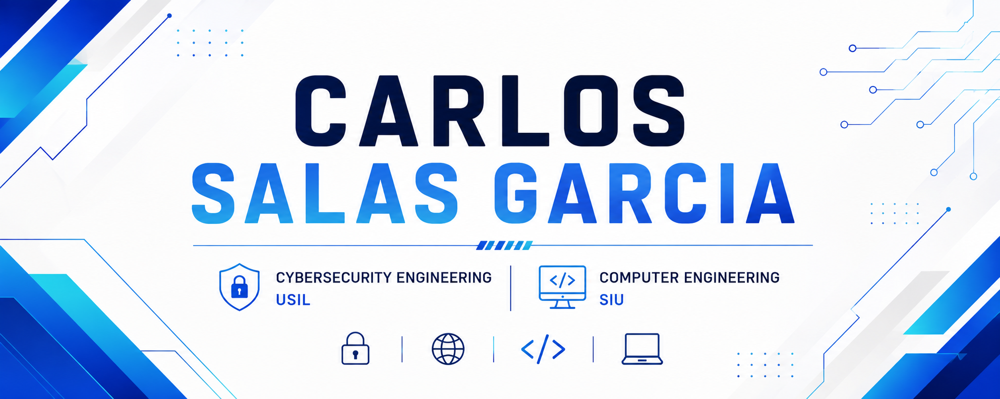

<div align="center">

</div>

<p align="center">
  
</p>

<p align="center">
  
  
  
</p>

---


## 🛡️ About Me

```yaml
carlos_salas_garcia:
  role: "Cybersecurity & Computer Engineering Student"
  passion: "Protegiendo sistemas, construyendo software y explorando redes"
  mindset: "Aprendizaje constante, mentalidad ofensiva y defensiva"
  goal: "Convertirme en un profesional referente en Ciberseguridad"
```
---

## 🛠️ Programming Languages

<p align="center">
  
  
  
  
  
</p>

---

## 🔐 Cybersecurity · Networking · Cloud

<p align="center">
  
  
  
  
  
</p>

<p align="center">
  
  
  
</p>

---

## 📜 Certifications & Learning

<p align="center">
  
  <br>
  
  <br>
  
  <br>
  
</p>

---

## 📂 Featured Projects

<div align="center">

### 🛡️ SOC Incident Response Platform — AWS
<p><em>Plataforma de Centro de Operaciones de Seguridad que monitorea eventos de AWS en tiempo real (CloudTrail + GuardDuty), correlaciona amenazas y genera tickets de incidentes automáticamente con mapeo a MITRE ATT&CK.</em></p>

[](https://github.com/p3lw/ticketing-system-aws)


<br><br>

### 🏥 Proyecto Clínica Web
<p><em>Aplicación web full-stack (backend + frontend) para gestión de una clínica.</em></p>

[](https://github.com/p3lw/proyecto-ciber)


<br><br>

### 🎫 Ticketing System (C++)
<p><em>Sistema de tickets con servidor backend en C++ y frontend en PHP, contenerizado con Docker.</em></p>

[](https://github.com/p3lw/c--ticketing-system)


</div>

---

## 📊 GitHub Stats

<p align="center">
  
  
</p>

<p align="center">
  
</p>

---

## 📫 Contact

<p align="center">
  <a href="https://TU_LINKEDIN" target="_blank"></a>
  <a href="mailto:TU_CORREO_PROFESIONAL"></a>
  <a href="https://TU_INSTAGRAM" target="_blank"></a>
  <a href="https://TU_FACEBOOK" target="_blank"></a>
</p>

<p align="center"><sub>⚡ "La seguridad no es un producto, es un proceso." — Bruce Schneier ⚡</sub></p>